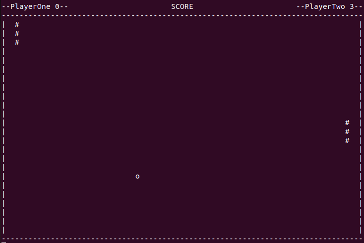

## PONG_GAME

### Instalation

<ol> 
<li>GCC compiler should be installed</li>
<li>Open src directory in comand line and run "gcc filename"</li>
There is two types of game interactive and non interactive. First type runs without key pressing. Second type runs after player presses the key.
<li>Run ./a.out file by default in comand line then you will see interface</li>
</ol>

### Сontrol

<ul>

Left Player

<li> A - move top</li>
<li>Z - move bottom</li>
</ul>

<ul>

Right Player

<li> K - move top</li>
<li>M - move bottom</li>
</ul>

<ul >
<li> Space - skip m</li>
<li>Enter - apply move</li>
</ul>